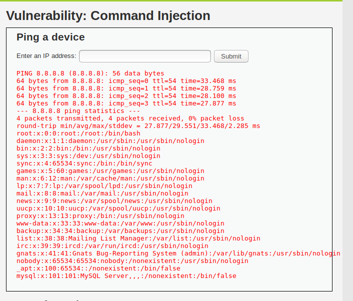
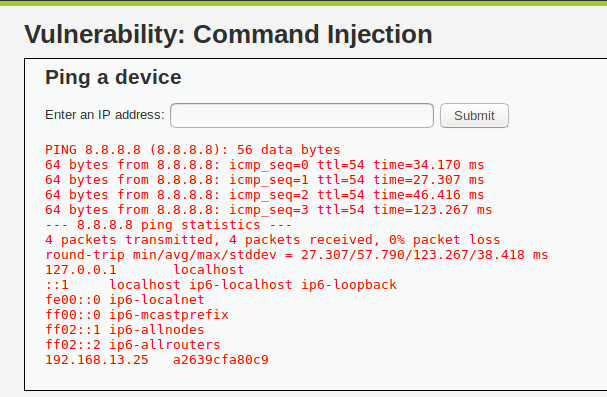
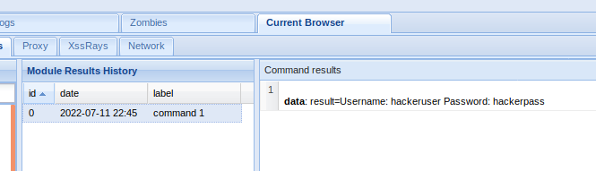

Web Application 1: Your Wish is My Command Injection

           Run: 8.8.8.8 && cat ../../../../../etc/passwd

        Run: 8.8.8.8 && cat ../../../../../etc/hosts

         Command Injection Prevention/ Mitgation Stratagies:
         Avoid system calls and user  input—to prevent threat actors from inserting characters into the OS command.Set up input validation—to prevent attacks like XSS and SQL Injection. Create a white list—of possible inputs, to ensure the system accepts only pre-approved inputs. Use only secure APIs—when executing system commands such as execFile().

Web Application 2: A Brute Force to Be Reckoned With

         Mitigation Stratagies:  A brute-force attack is an attempt to discover a password by systematically trying every possible combination of letters, numbers, and symbols until you discover the one correct combination that works. If your web site requires user authentication, you are a good target for a brute-force attack. The most obvious way to block brute-force attacks is to simply lock out accounts after a defined number of incorrect password attempts. Account lockouts can last a specific duration, such as one hour, or the accounts could remain locked until manually unlocked by an administrator.

Web Application 3: Where's the BeEF?

               Mitigation Stratagies: Education. Teach your users how to recognise strange links and how to identify phishing emails. Help them understand that the company stays in business because outsiders can't access confidential documents. Policy. Enforce good user behaviour by asserting certain practices and limitations in your company policy. Make every user read and sign a copy. Remember that this policy must not be full of jargon - the average person in your business has to be able to fully comprehend it. Include reasons for policies, too. There are other questions about policy writing on this site, so feel free to dig around.Patching. Keep up to date on all patches for your browser, plugins (e.g. Flash), OS and applications (PDF reader, Office, etc.).Configuration. Alter the security settings on your browser to prevent JavaScript and plugins by default. You could use AdBlock and NoScript to help reduce your attack surface. Protection. Use an anti-malware solution and a firewall on every machine. Pick an AV that's relatively lightweight - the detection rates don't vary much between the major vendors. If you're not keen on AV products, at least install Microsoft Security Essentials. Either way, keep the AV and firewall up to date.Scanning. Upload untrusted executables and documents to an AV aggregation tool such as VirusTotal. This gives you a good early warning if the file is infected.