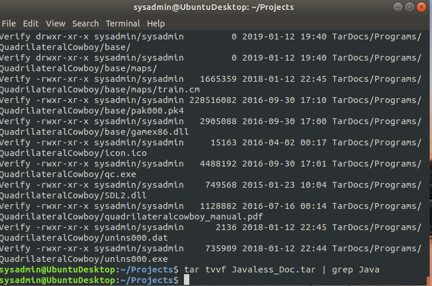
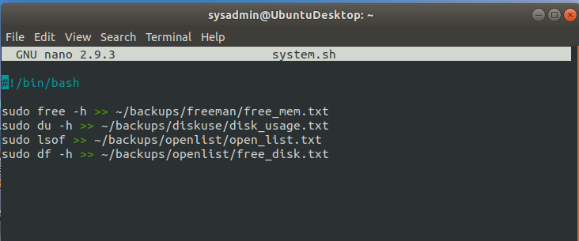
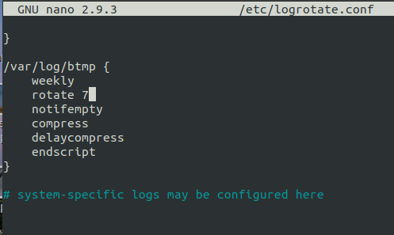

## Week 5 Homework Submission File: Archiving and Logging Data

Please edit this file by adding the solution commands on the line below the prompt.

Save and submit the completed file for your homework submission.

---

### Step 1: Create, Extract, Compress, and Manage tar Backup Archives

1. Command to **extract** the `TarDocs.tar` archive to the current directory:

        tar tvvf TarDocs.tar

        tar xvvf TarDocs.tar

2. Command to **create** the `Javaless_Doc.tar` archive from the `TarDocs/` directory, while excluding the `TarDocs/Documents/Java` directory:

        tar cvvWf Javaless_Doc.tar --exclude "TarDocs/Documents/Java" TarDocs

3. Command to ensure `Java/` is not in the new `Javaless_Docs.tar` archive:

        tar tvvf Javaless_Doc.tar | grep Java

#### Critical Analysis Question

- Why wouldn't you use the options `-x` and `-c` at the same time with `tar`?

        -x is to extract and -c instructs to create a tar file. You cannot extract and create at the same time.
---

### Step 2: Create, Manage, and Automate Cron Jobs

1. Cron job for backing up the `/var/log/auth.log` file:

        0 6 * * 3 sudo tar cvvf auth_backup.tgz var/log/auth.log
---

### Step 3: Write Basic Bash Scripts

1. Brace expansion command to create the four subdirectories:

        sudo mkdir -p backups/{freeman,diskuse,openlist,freedisk}

        nano system.sh
2. Paste your `system.sh` script edits below:

    

    

3. Command to make the `system.sh` script executable:

        chmod +x system.sh
**Optional**
- Commands to test the script and confirm its execution:

      sudo  ./system.sh
      
**Bonus**
- Command to copy `system` to system-wide cron directory:

        sudo cp system.sh /etc/cron.weekly
---

### Step 4. Manage Log File Sizes
 
1. Run `sudo nano /etc/logrotate.conf` to edit the `logrotate` configuration file. 

    Configure a log rotation scheme that backs up authentication messages to the `/var/log/auth.log`.

    - Add your config file edits below:

