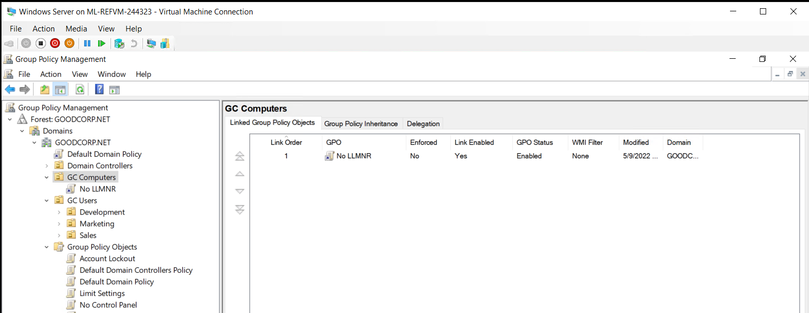
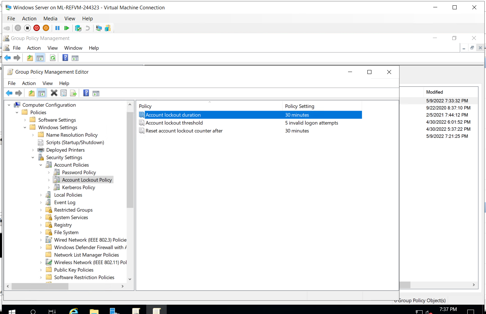
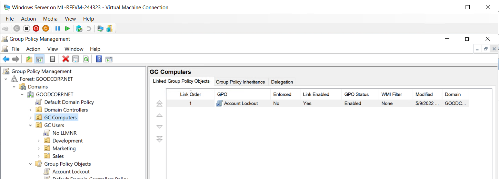
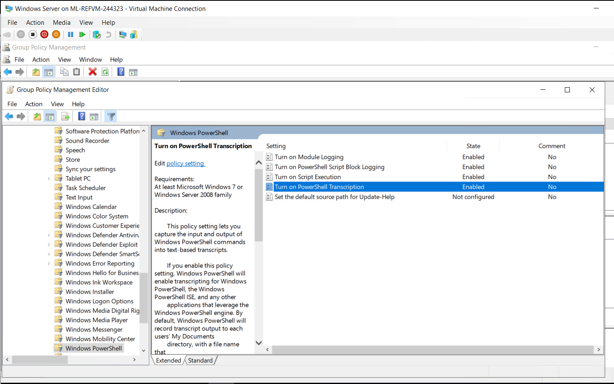
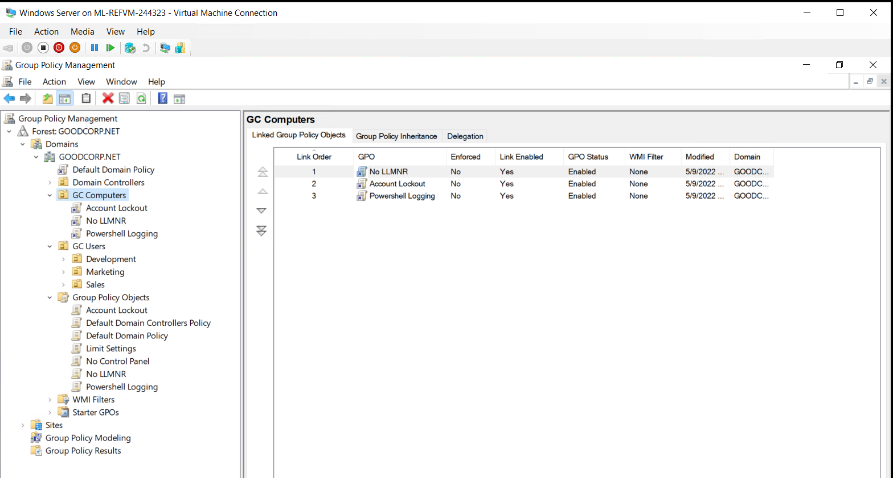
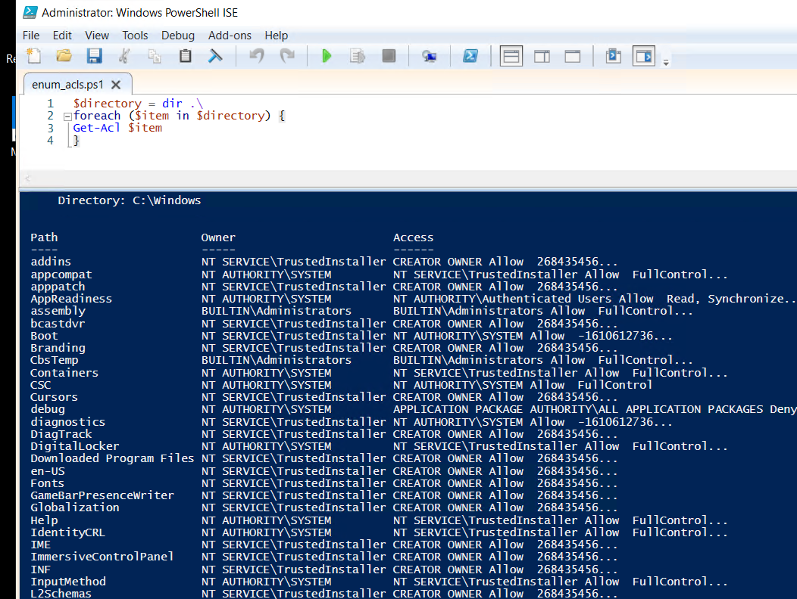

Task 1: Create a GPO: Disable Local Link Multicast Name Resolution (LLMNR)
For this first task, you will investigate and mitigate one of the attack vectors that exists within a Windows domain.

Task 2: Create a GPO: Account Lockout
For security and compliance reasons, the CIO needs us to implement an account lockout policy on our Windows workstation. An account lockout disables access to an account for a set period of time after a specific number of failed login attempts. This policy defends against brute-force attacks, in which attackers can enter a million passwords in just a few minutes.
Account lockouts have some important considerations. Read about these in the following documentation:

Microsoft Security Guidance: Configuring Account Lockout
You only need to read the "Account Lockout Tradeoffs" and "Baseline Selection" sections.

Task 3: Create a GPO: Enabling Verbose PowerShell Logging and Transcription

Task 4: Create a Script: Enumerate Access Control Lists

