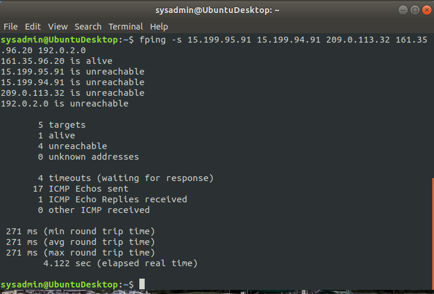
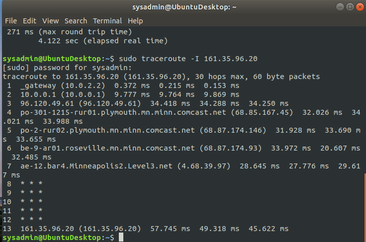
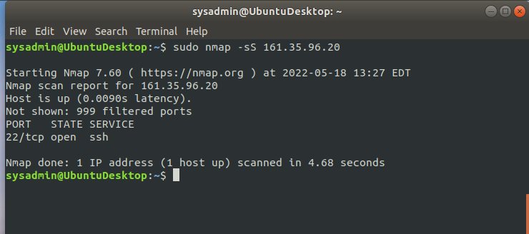
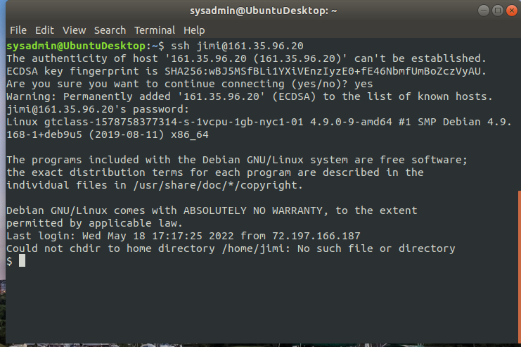
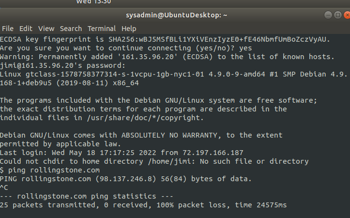
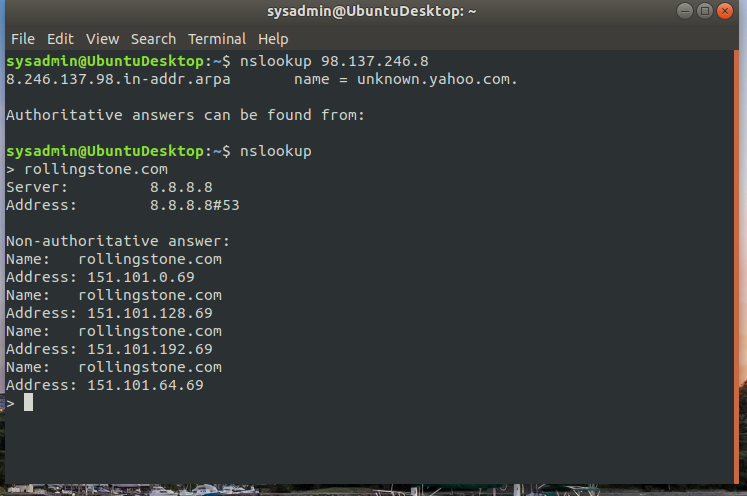
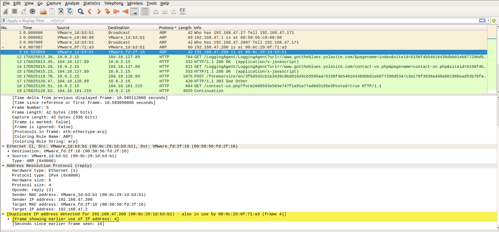

Phase 1: "I'd like to Teach the World to Ping"
You have been provided a list of network assets belonging to RockStar Corp. Use fping to ping the network assets for only the Hollywood office.

     servers are not responding except 161.35.96.20 This is a vulnerability on network layer 3.

Phase 2:  "Some Syn for Nothin`"

        This shows that Port 22 is open. The Osi layer SYN scan runs on is layer 4.

Phase 3: "I Feel a DNS Change Comin' On"

Phase 4:  "ShARP Dressed Man"

        This occurred on the application layer 7.