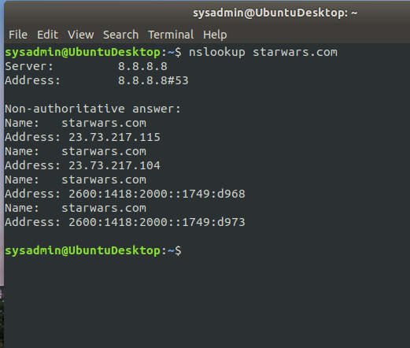
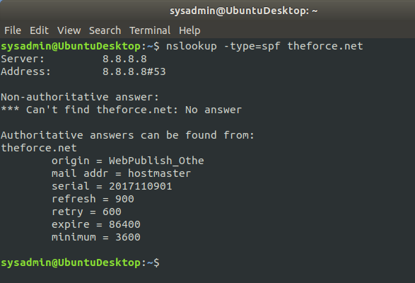
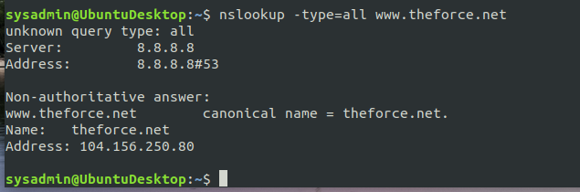
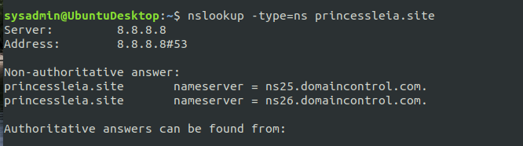
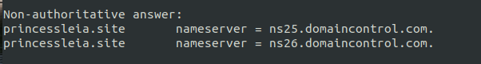
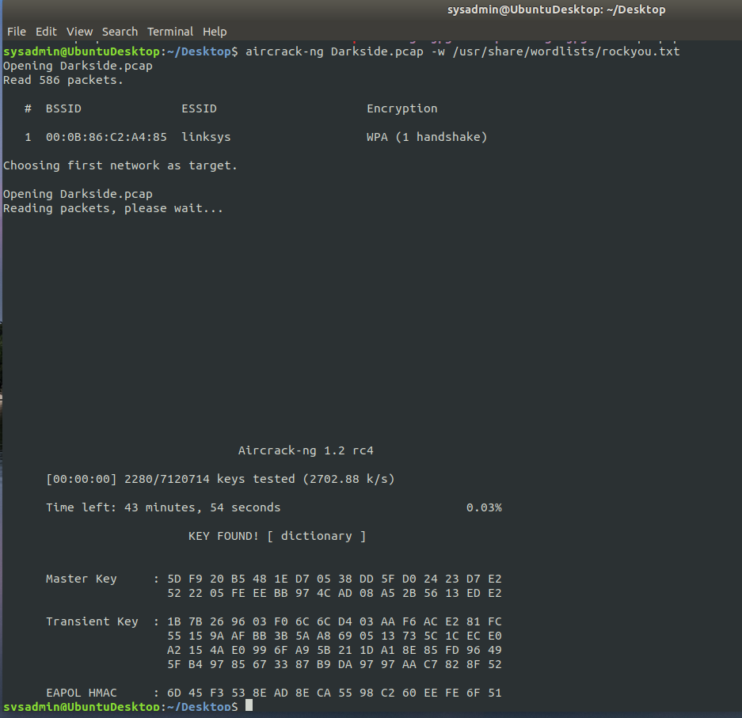
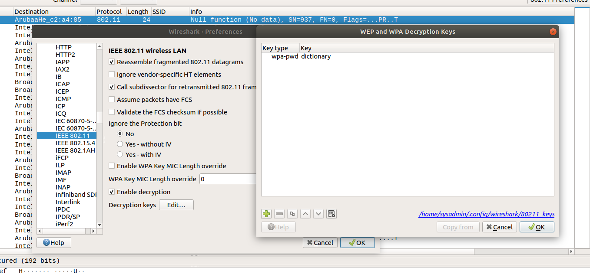
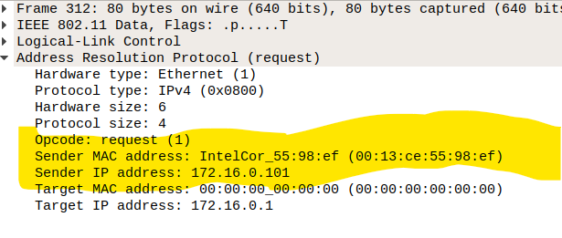
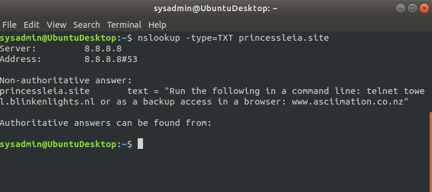
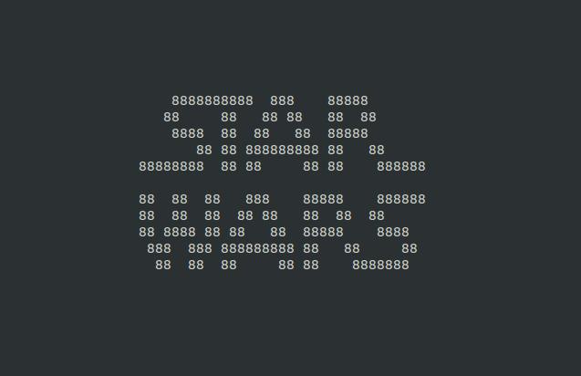

Mission 1
Your mission:

Determine and document the mail servers for starwars.com using NSLOOKUP.

Explain why the Resistance isn't receiving any emails.

        Their new email servers are not being advertised on the internet. They did not update their mail server list and secondary mail server to their list. 

Document what a corrected DNS record should be.

        A corrected DNS would include these new servers.

Mission 2
Determine and document the SPF for theforce.net using NSLOOKUP.

Explain why the Force's emails are going to spam.

        The new IP address for their mail server foes not match their IP address that's available to the public- due to this the emails are going into spam.

Document what a corrected DNS record should be.

        A corrected DNS would include the new IP address that was set up when the network was down (45.23.176.21)

Mission 3

Your mission:

Document how a CNAME should look by viewing the CNAME of www.theforce.net using NSLOOKUP.
 
 

Explain why the sub page of resistance.theforce.net isn't redirecting to theforce.net.

        Traffic giong to resistance.theforce.net is not redirecting to theforce.net because the CNAME does not have resistance.theforce.net included

Document what a corrected DNS record should be.

        The corrected DNS record would have included resistance.theforce.net as a "canonical name" It should show canonical name = resistance.theforce.net

Mission 4

Your mission:

Confirm the DNS records for princessleia.site.

Document how you would fix the DNS record to prevent this issue from happening again.

        Add the secondary DNS server the resistance team provided at ns2.galaxybackup.com and include the screenshot below 

Mission 5

Your Mission:

Document this shortest path so it can be used by the Resistance to develop a static route to improve the traffic.

        Shortest path  that does not include Planet N is: Batuu — D —- C — E — F —J — I — L— Q —-T —-- V —- Jedha
        Total number of hops is 24

Mission 6

Your Mission:

Figure out the Dark Side's secret wireless key by using Aircrack-ng.

Hint: This is a more challenging encrypted wireless traffic using WPA.

In order to decrypt, you will need to use a wordlist (-w) such as rockyou.txt.

Use the Dark Side's key to decrypt the wireless traffic in Wireshark.

Hint: The format for they key to decrypt wireless is <Wireless_key>:<SSID>.

Once you have decrypted the traffic, figure out the following Dark Side information:

Host IP Addresses and MAC Addresses by looking at the decrypted ARP traffic.

Sender and Target Info:

Mission 7
As a thank you for saving the galaxy, the Resistance wants to send you a secret message!
Your Mission:

View the DNS record from Mission #4.

The Resistance provided you with a hidden message in the TXT record, with several steps to follow.

Follow the steps from the TXT record.

Note: A backup option is provided in the TXT record (as a website) in case the main telnet site is unavailable

Take a screen shot of the results.

Conclusion